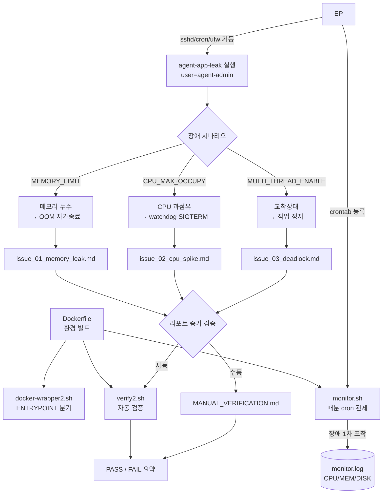
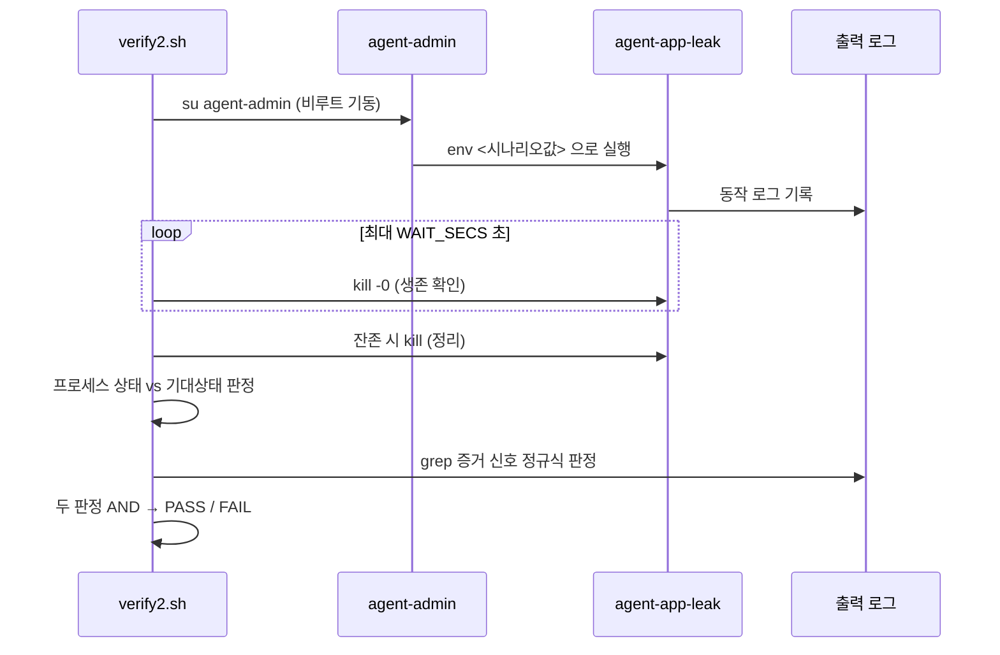

# 구조도

## 전체 흐름 — 환경 구축부터 검증까지

```mermaid
flowchart TD
    DF[Dockerfile<br/>환경 빌드] --> WRAP[docker-wrapper2.sh<br/>ENTRYPOINT 분기]
    DF --> MON[monitor.sh<br/>매분 cron 관제]
    DF --> VS[verify2.sh<br/>자동 검증]

    EP -->|sshd/cron/ufw 기동| RUN[agent-app-leak 실행<br/>user=agent-admin]
    EP -->|crontab 등록| MON
    MON -->|장애 1차 포착| LOG[(monitor.log<br/>CPU/MEM/DISK)]

    RUN --> SC{장애 시나리오}
    SC -->|MEMORY_LIMIT| M1[메모리 누수<br/>→ OOM 자가종료]
    SC -->|CPU_MAX_OCCUPY| M2[CPU 과점유<br/>→ watchdog SIGTERM]
    SC -->|MULTI_THREAD_ENABLE| M3[교착상태<br/>→ 작업 정지]

    M1 --> R1[issue_01_memory_leak.md]
    M2 --> R2[issue_02_cpu_spike.md]
    M3 --> R3[issue_03_deadlock.md]

    R1 & R2 & R3 --> V{리포트 증거 검증}
    V -->|자동| VS
    V -->|수동| MV[MANUAL_VERIFICATION.md]
    VS --> RESULT[PASS / FAIL 요약]
    MV --> RESULT
```

## verify2.sh 검증 시퀀스 (시나리오 1건)

```mermaid
sequenceDiagram
    participant V as verify2.sh
    participant A as agent-admin
    participant APP as agent-app-leak
    participant L as 출력 로그

    V->>A: su agent-admin (비루트 기동)
    A->>APP: env <시나리오값> 으로 실행
    APP->>L: 동작 로그 기록
    loop 최대 WAIT_SECS 초
        V->>APP: kill -0 (생존 확인)
    end
    V->>APP: 잔존 시 kill (정리)
    V->>V: 프로세스 상태 vs 기대상태 판정
    V->>L: grep 증거 신호 정규식 판정
    V->>V: 두 판정 AND → PASS / FAIL
```
